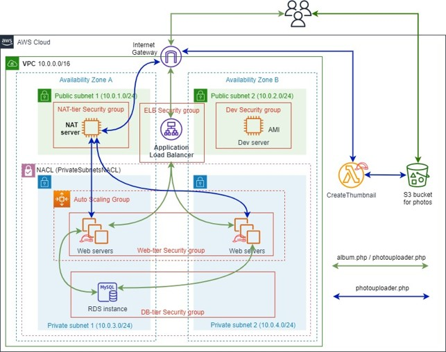
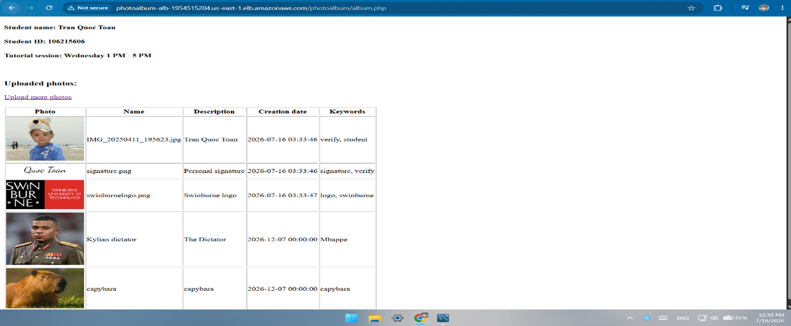
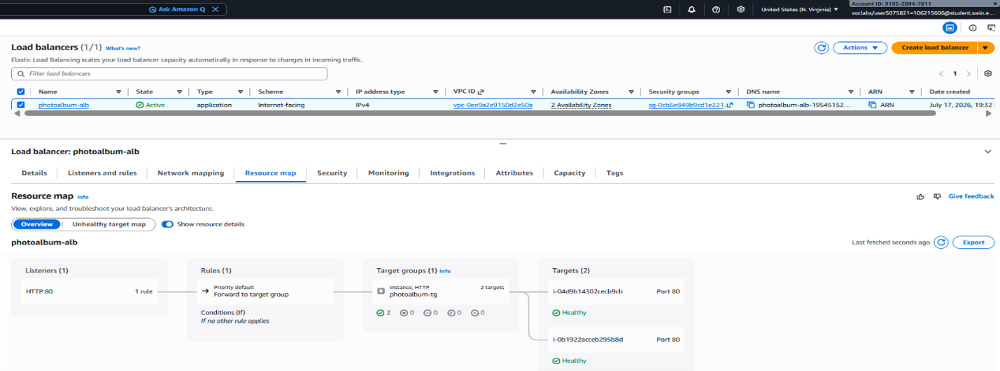
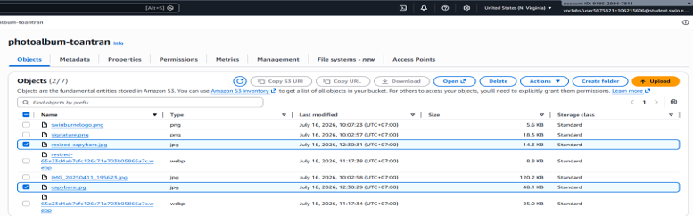

# Highly Available Photo Album Platform on AWS

One-line summary: A self-healing, auto-scaling web application 
with serverless image processing, deployed on AWS.

## Overview
- Problem: A photo-sharing web app that needs to handle variable 
  load and recover automatically from instance failure.
- Outcome: Multi-AZ architecture with auto-scaling, layered 
  security, and serverless image thumbnail generation.

## Architecture

- Traffic flow: User → ALB → Auto Scaling Group (private subnets) 
  → S3 / RDS / Lambda

## Key Design Decisions
(Most important section — write as decision + reasoning + trade-off)
- Why NAT Gateway over a self-managed NAT instance
- Why a referrer-based S3 bucket policy over signed URLs / CloudFront
- Why Application Load Balancer over Classic Load Balancer
- Why request-count-based target tracking over CPU-based scaling

## Security Model
- Three layers: Security Groups (least-privilege) / Network ACLs 
  (ICMP isolation) / IAM (scoped role)
- Short table: SG name → allowed source → port → rationale

## Challenges & Debugging
(Highest-value section — 3-4 representative cases, not an exhaustive log)
- Case 1: IAM instance profile not persisted in custom AMI → 
  root cause → fix
- Case 2: Lambda Sandbox.Timedout → duration/memory analysis → fix
- Case 3: S3 Access Denied despite a correctly-scoped policy → 
  referrer header mismatch → fix
Format each case as: **Symptom → Diagnosis → Fix** (3-4 lines each)

## What I'd Improve for Production
- Scoped IAM role instead of a broad lab role
- RDS Multi-AZ with automated backups
- HTTPS via ACM + Route 53
- CloudWatch Alarms and centralized logging
- Full Infrastructure as Code (CloudFormation/Terraform) instead 
  of manual console configuration

## Tech Stack
AWS: VPC, EC2, Auto Scaling, ALB, Lambda (Python), S3, RDS (MySQL), 
IAM, Network ACL
Application: PHP, AWS SDK

## Screenshots
[3-5 most representative images — not the full 35-image assignment set]

## Challenges & Debugging

### Case 1: IAM credentials failed with a 404 error
**Symptom:** The photo upload feature failed with 
`Error retrieving credentials from the instance profile metadata 
service... 404 Not Found`.
**Diagnosis:** The EC2 instance had no IAM role attached, so the 
AWS SDK had no credentials to call S3. Verifying with 
`curl http://169.254.169.254/latest/meta-data/iam/security-credentials/` 
confirmed the endpoint returned nothing.
**Fix:** Attached an IAM instance profile to the instance. 
Importantly, this surfaced a subtler issue: an instance profile is 
**not** captured when a custom AMI is created from an instance — it 
must be explicitly attached to the Launch Template used by the Auto 
Scaling Group, otherwise every instance launched from the AMI 
inherits the same missing-credentials problem.

### Case 2: Lambda function timed out during image processing
**Symptom:** Thumbnail generation failed with 
`Sandbox.Timedout: Task timed out after 3.00 seconds`.
**Diagnosis:** The function's default configuration (3-second 
timeout, 128 MB memory) was insufficient to download the source 
image from S3, resize it, and upload the result back — especially 
accounting for cold-start latency.
**Fix:** Increased the timeout to 30 seconds and memory to 256 MB 
(Lambda also allocates proportionally more CPU with more memory, 
reducing execution time). Verified success via the CloudWatch 
`REPORT` log line showing actual duration well under the new limit.

### Case 3: S3 objects returned Access Denied despite a correct policy
**Symptom:** Photos uploaded successfully and metadata was correct, 
but images failed to render on the photo album page — while direct 
access to the object URL correctly returned Access Denied.
**Diagnosis:** The bucket policy granted `s3:GetObject` conditionally 
on the HTTP `Referer` header matching the application's domain. The 
policy had been written against an earlier domain (the Dev Server's 
IP) before the Application Load Balancer was provisioned, so the 
Referer sent by the browser no longer matched the policy condition.
**Fix:** Updated the policy's `aws:Referer` condition to the ALB's 
DNS name and confirmed correct behavior in both directions: direct 
object URLs are denied, while the same objects load correctly when 
referenced from the application.
